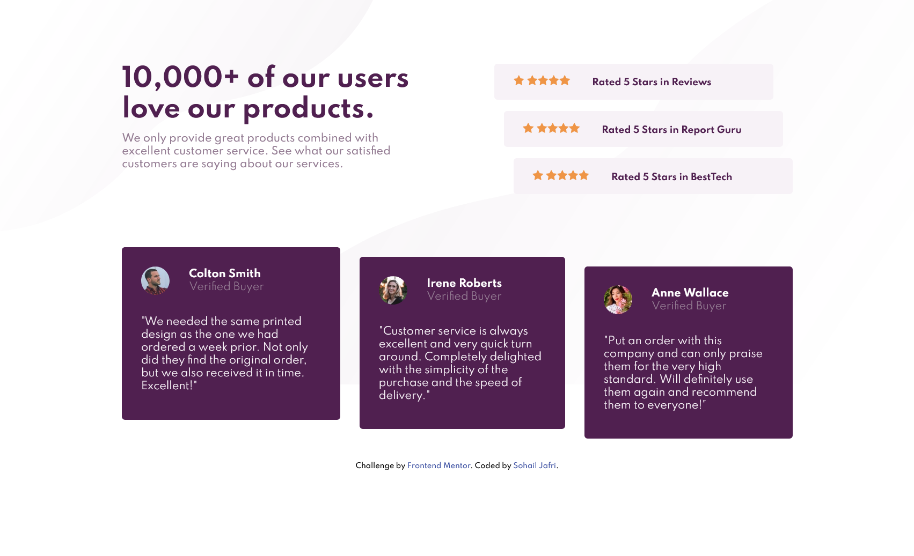

# Frontend Mentor - Social proof section solution

This is a solution to the [Social proof section challenge on Frontend Mentor](https://www.frontendmentor.io/challenges/social-proof-section-6e0qTv_bA). Frontend Mentor challenges help you improve your coding skills by building realistic projects. 

## Table of contents

- [Overview](#overview)
  - [The challenge](#the-challenge)
  - [Screenshot](#screenshot)
  - [Links](#links)
- [My process](#my-process)
  - [Built with](#built-with)
  - [What I learned](#what-i-learned)
- [Author](#author)


**Note: Delete this note and update the table of contents based on what sections you keep.**

## Overview

### The challenge

Users should be able to:

- View the optimal layout for the section depending on their device's screen size

### Screenshot




### Links

- Solution URL: [Add solution URL here](https://app.netlify.com/sites/fm-socialproofsection-dopedev/overview)
- Live Site URL: [Add live site URL here](https://github.com/thesohailjafri/fm-social-proof-section)

## My process

### Built with

- Semantic HTML5 markup
- CSS custom properties
- Flexbox
- Desktop-first workflow

### What I learned

Learned how to use column-gap, row-gap, flex, flex-grow in flex-box css

```html
<div class="contain-flex">
<div class="child"></div>
<div class="child"></div>
<div class="child"></div>
</div>
```
```css
.contain-flex{
  display:flex;
  flex-direction:row;
column-gap:20px
}

.child {
  width:100px;
  height:100px;
  color:gray;
}
```

## Author

- Website - [Add your name here](https://www.thesohailjafri.com)
- Frontend Mentor - [@yourusername](https://www.frontendmentor.io/profile/thesohailjafri)
- Twitter - [@yourusername](https://www.twitter.com/thesohailjafri)

